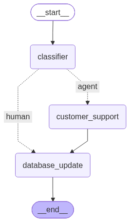

## Overview

An LLM-powered workflow with a RAG-equipped agent that automatically resolves customer return and refund queries for an e-commerce company. Return and refund questions are among the most common in customer support, so automating them frees the team to focus on complex cases and improves efficiency. The workflow reads customer queries from a database, and the agent uses a Retrieval-Augmented Generation (RAG) tool to look up the company's official policy documents and respond to queries within scope, while leaving the rest of the queries to human.

The workflow is evaluated on a Q&A set generated with [Ragas](https://docs.ragas.io/en/stable/) that is manually verified for correctness and also includes off-topic queries. Three metrics are used: classification accuracy, and two Ragas metrics, **Faithfulness** (are answers supported by the retrieved documents?) and **Answer Correctness** (do answers match the ground truth?).

**Results:** The classifier routed all 15 test questions correctly. The agent's responses are largely grounded in the retrieved policy (mean Faithfulness 0.85) and generally align with the reference answers (mean Answer Correctness 0.76). The agent can occasionally produce weaker responses with unsupported details or incomplete answers.

## Main Features

### 1. Smart Query Routing
An autonomous classifier decides whether the agent or a human support team should handle each query. Questions regarding return and refund are handled by an agent while questions beyond the scope are left for humans.

### 2. Policy-Grounded Answers
The agent uses a RAG tool to retrieve relevant policy sections before responding. This reduces hallucination and keeps answers reliable and consistent with company rules.

### 3. Precision Retrieval with Reranking
Top-k retrieved documents are reranked by a cross-encoder model to select the most relevant ones. Better context leads to more accurate answers.

Note: [Claude AI](https://claude.ai) was used to help with the coding.

## Tech Stack

**LLM & Orchestration:** LangGraph, LangChain, Ollama, LiteLLM  
**RAG Retrieval:** ChromaDB, Sentence-Transformers, pypdf  
**Evaluation & Observability:** Ragas, Langfuse  
**Database:** PostgreSQL, SQLAlchemy  

All LLM and embedding models are open-source models from Ollama or HuggingFace, run locally within an 8GB VRAM constraint.

## Workflow
<figure>
  
  <figcaption align="center"><i>Figure 1: Customer Support Workflow.</i></figcaption>
</figure>

 

Customer queries are read from a PostgreSQL database and passed into the workflow, which classifies each query and routes it to either the AI agent or a human. The final result is written back to the database. From here, additional nodes can be added to send the reply directly to the customer or to a customer support operator for review.

### 1. Classifier Node

**Model:** `qwen3:4b-instruct-2507-q4_K_M`

Takes in the customer query and determines whether it is about returning a product, requesting a refund, or asking about the return/refund policy.

- Outputs `agent` if the query is about returning a product or requesting a refund for a product.
- Outputs `human` for anything else. The agent does not handle these queries, and the workflow routes directly to the `database_update` node.

### 2. Customer Support Agent Node

**Model:** `qwen3:4b-instruct-2507-q8_0`

Receives the customer query and has access to the RAG tool for retrieving relevant policy documents. The agent:

1. Formulates a focused, specific search query that captures the customer's issue, and calls the RAG tool if it deems necessary.
2. Reviews the retrieved documents. If they are irrelevant, it formulates a different search and calls the tool again.
3. Uses the relevant documents to craft a final response that directly addresses the customer's query.

### 3. Database Update Node

Updates the database with:

- The classification result (`agent` or `human`).
- The agent's response.
- The retrieved documents used to generate the response, if any tool call was used.

## Getting the Policy PDF

The policy PDF used to populate the vector database is not included in this repository because its content comes from Shopee's official website and belongs to Shopee. To reproduce the setup, the PDF was created using the following the steps below.

### 1. Collect the policy content

Scrape or copy the official Shopee return and refund [policy](https://help.shopee.sg/portal/4/category/17470-Policies/17472-Shopee-Policies?page=1), along with the relevant return and refund Q&A pages. Keep the text strictly limited to returns and refunds. The PDF serves two purposes, and unrelated content hurts both:

- **RAG retrieval:** irrelevant text adds noise to the vector database and lowers the quality of retrieved documents.
- **Ragas test set generation:** irrelevant text leads to off-topic questions in the evaluation set.

### 2. Convert tables to plain text

PDF readers often struggle with tables. Even when the text is extracted, it can lose its arrangement without the table lines, making it hard to interpret. Convert every table into plain text, so the final PDF contains only text with no tables or images. One approach this can be done is by converting each table row into a labelled section with the columns as the labels.

## Generation of Test Dataset for Workflow Evaluation

The test dataset is built in three stages: Ragas generates return/refund Q&A pairs from the policy PDF, an LLM adds off-topic queries the agent in the workflow should not handle, and a final step rewrites everything into realistic customer support emails to match the format of expected real data.

Every question and response is manually verified to confirm the questions are reasonable and the responses are correct. Because of computational constraints, a small model is used for Ragas generation, so most of the generated data is rejected and only a small verified set is used for evaluation.

### 1. Ragas Test Set Generation

Q&A pairs are generated from the document chunks extracted from the policy PDF, using a generator LLM and an embedding model. Questions vary in difficulty (`SingleHop`, `MultiHopSpecific`, `MultiHopAbstract`) according to a specified distribution.

| Component | Model | Reason |
|---|---|---|
| Generator LLM | `ollama_chat/qwen3:8b` | Needs to be capable and follow instructions well enough to obey Ragas prompts for generating Q&A pairs and create Knowledge Graph needed for generation.|
| Embedding model | `BAAI/bge-large-en-v1.5` | Same model used to embed the documents into the vector database, so documents retrieved by the RAG tool are equivalent during evaluation. A strong english-only general-purpose model that should cover the return/refund policy text. |

### 2. Adding Unanswerable Questions

Ragas only produces return/refund questions. In practice, the workflow receives all kinds of customer queries but should only handle return/refund ones, so off-topic questions are needed to test whether it routes them correctly.

An LLM generates realistic, diverse customer queries that a support team might receive, covering topics such as:

- Order status and tracking
- Order modification
- Product questions
- Account issues
- Payment

**Model:** `qwen3:4b-instruct-2507-q4_K_M`

### 3. Conversion to Email Format

Q&A pairs from Ragas and the LLM are direct, general questions, whereas real customers rarely write that way. To match the style and tone of real queries, an LLM:

- Rewrites each question as a realistic customer email, including order details and reasons for the email.
- Rewrites each response as a professional support email that directly addresses the customer's query.

**Model:** `qwen3:4b-instruct-2507-q4_K_M`

## Ragas Evaluation

The workflow, in particular the agent with the RAG tool, is evaluated using LLM-as-a-Judge. Many metrics exist for evaluating RAG systems, but this project focuses on the most important ones: classification accuracy, **Faithfulness**, and **Answer Correctness** (which requires a reference answer). 

Given that scores from LLM-as-a-judge may vary slightly between runs due to LLM judge non-determinism, the Faithfulness and Answer Correctness metrices are calculated multiple times per evaluated response with the final score assigned being the average of the multiple evaluations.

The statistic of each metric is presented instead of using only the average to allow for a better representation of the performance of the workflow. For the test set used for evaluation, it contains 10 return/refund questions and 5 unanswerable ones. The sample size is small, so these results are indicative rather than conclusive.

**Models:**
- LLM (LLM-as-a-Judge) : `ollama_chat/qwen3:8b`
- Embedding model (required for Answer Correctness): `BAAI/bge-large-en-v1.5`

### Metrics

| Metric | What it measures | Why it matters |
|---|---|---|
| **Classification accuracy** | Percentage of questions correctly classified (agent vs. non-agent) by the classifier node | Ensures the workflow is reliable and only handles the scope it is assigned |
| **Faithfulness** | How factually consistent the response is with the context retrieved by the RAG tool. Score from 0 to 1: the fraction of claims in the response supported by the retrieved context (higher is better) | Ensures responses are based on the actual policy document rather than hallucination |
| **Answer Correctness** | How closely the response aligns with the ground-truth reference. Score from 0 to 1 (higher is better): a weighted sum of factual correctness (0.75) and semantic similarity (0.25). Factual correctness is the F1 score computed from the true positive, false positive and false negative counts of the statements in the response | Ensures answers are accurate and complete compared to the expected answer |

## Results

The test set contains **10 Q&A pairs** (return/refund questions) and **5 unanswerable questions** (off-topic queries).

### Classification Accuracy

| Metric | Score |
|---|---|
| Accuracy | **1.00** |

- The classifier routed all 15 questions correctly, meaning the workflow reliably separates return/refund queries from off-topic ones.

### Faithfulness

Computed on the 10 responses that used the RAG tool to generate a response.

| Statistic | Mean | Std | Min | 25% | Median | 75% | Max |
|---|---|---|---|---|---|---|---|
| Value | **0.849** | 0.208 | 0.500 | 0.664 | 1.000 | 1.000 | 1.000 |

- The mean of 0.85 and a median of 1.0 show that most responses are fully supported by the retrieved policy, so hallucination is limited. The minimum of 0.5 and the standard deviation of 0.21 indicate that there are a few outliers responses which contain claims not backed by the retrieved context. This indicates that the agent could occassionally add unsupported details in its response.

### Answer Correctness
Computed on the 10 questions for which the agent generated responses.

| Statistic | Mean | Std | Min | 25% | Median | 75% | Max |
|---|---|---|---|---|---|---|---|
| Value | **0.757** | 0.143 | 0.535 | 0.676 | 0.767 | 0.895 | 0.912 |

- A mean/median of 0.76 and 25 percentile score of 0.68 shows that LLM generated responses generally align well with the reference answers. The lowest score of 0.53 and standard deviationn of 0.14 suggests that the agent could sometimes produce answers that are incomplete or partly incorrect.